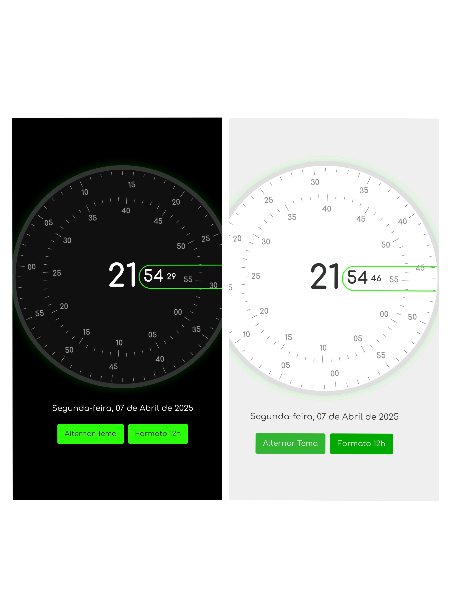

# Relógio Analógico Elegante

Um relógio analógico interativo e estilizado criado com HTML, CSS e JavaScript puro.



## Funcionalidades

- Design elegante e minimalista
- Exibição de hora, minutos e segundos em formato analógico e digital
- Exibição da data completa em português
- Alternância entre formato 12h e 24h
- Alternância entre tema claro e escuro
- Responsivo para todos os tamanhos de tela
- Preferências salvas no navegador

## Tecnologias Utilizadas

- HTML5
- CSS3 (com variáveis CSS para temas)
- JavaScript (ES6+)
- Fonte Comfortaa do Google Fonts

## Como Usar

1. Clone este repositório:

2. Abra o arquivo `index.html` em qualquer navegador moderno.

3. Interaja com os botões na parte inferior para:
- Alternar entre tema claro e escuro
- Alternar entre formato 12h e 24h

## Personalização

Você pode personalizar facilmente as cores do relógio editando as variáveis CSS no início do arquivo `index.html`:

```css
:root {
 --primary-color: #29ff08;
 --background-color: #000000;
 --clock-background: #111;
 --border-color: #333;
 --text-color: #fff;
}

.light-theme {
 --primary-color: #00aa00;
 --background-color: #f0f0f0;
 --clock-background: #fff;
 --border-color: #ddd;
 --text-color: #333;
}
